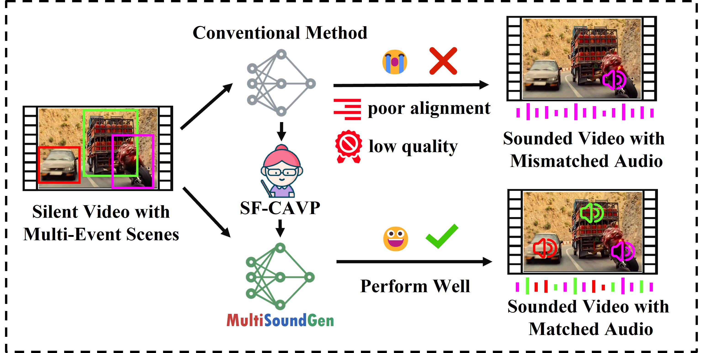
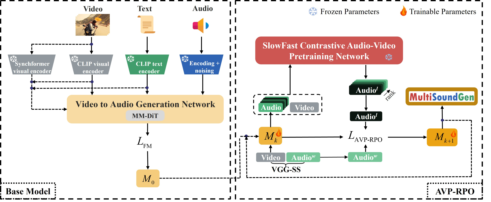

# MultiSoundGen

<p align="center">
  <a href="https://arxiv.org/abs/2509.19999">
    
  </a>
  &nbsp;
  <a href="https://v2aresearch.github.io/MultiSoundGen/">
    
  </a>
  <br>
  <strong>MultiSoundGen</strong>: a novel V2A framework for multi-event scenarios.
</p>

---

**MultiSoundGen** introduces direct preference optimization (DPO) into the Video-to-Audio (V2A) domain, leveraging audio-visual pretraining (AVP) to enhance performance in complex multi-event scenarios.

**Key Contributions:**<br>
 **1.** **SlowFast Contrastive AVP (SF-CAVP)**, a pioneering AVP model with a unified dual-stream architecture. SF-CAVP explicitly aligns core semantic representations and rapid dynamic features of audio-visual data to handle multi-event complexity; <br>
 **2.** We integrate the DPO method into V2A task and propose **AVP-Ranked Preference Optimization (AVP-RPO)**. It uses SF-CAVP as a reward model to quantify and prioritize critical semantic-temporal matches while enhancing audio quality. 



---

## 📰 News
- **Coming Soon** &nbsp; 📝 All source codes, models and datasets will be publicly available upon publication of the paper.
- **2025.10** &nbsp; 🔥[Demo page](https://v2aresearch.github.io/MultiSoundGen/) covering various scenarios is now online!
- **2025.09** &nbsp; 🔥[MultiSoundGen paper](https://arxiv.org/abs/2509.19999) released on arXiv!

---

## 🚀 Features
- **AVP Model**: Pioneering AVP model with a unified dual-stream architecture.
- **Model-Based DPO**: Uses AVP model as a reward model to directly optimize V2A generation.
- **V2A SOTA**: Achieves state-of-the-art V2A results in complex multi-event scenarios.

---

## ✨ Method Overview

The backbone of MultiSoundGen is MM-DiT trained with a CFM objective. Two key innovations underpin MultiSoundGen: SF-CAVP and AVP-RPO. AVP-RPO uses SF-CAVP as a reward model to iteratively optimize the base model, boosting audio-video alignment and audio quality.



---

## 📝 TODO
- [ ] Release complete source code and training scripts
- [ ] Release models and datasets

---

## 📖 Citation

If you find MultiSoundGen useful in your research or work, please cite our paper:

```
Yang, J.; Yang, X.; Zhang, L.; Guo, X.; Wang, Z.and Huang, G. 2025. MultiSoundGen: Video-to-Audio Generation for Multi-Event Scenarios via SlowFast Contrastive Audio-Visual Pretraining and Direct Preference Optimization. arXiv preprint arXiv:2509.19999.

```
## 📬 Contact

If you have any questions, suggestions, or would like to collaborate, please feel free to reach out to us:

- **Email**: [yangjianxuan@xiaomi.com](mailto:yangjianxuan@xiaomi.com)
- **GitHub Issues**: [MultiSoundGen GitHub Issues](https://github.com/v2aresearch/MultiSoundGen/issues)

---